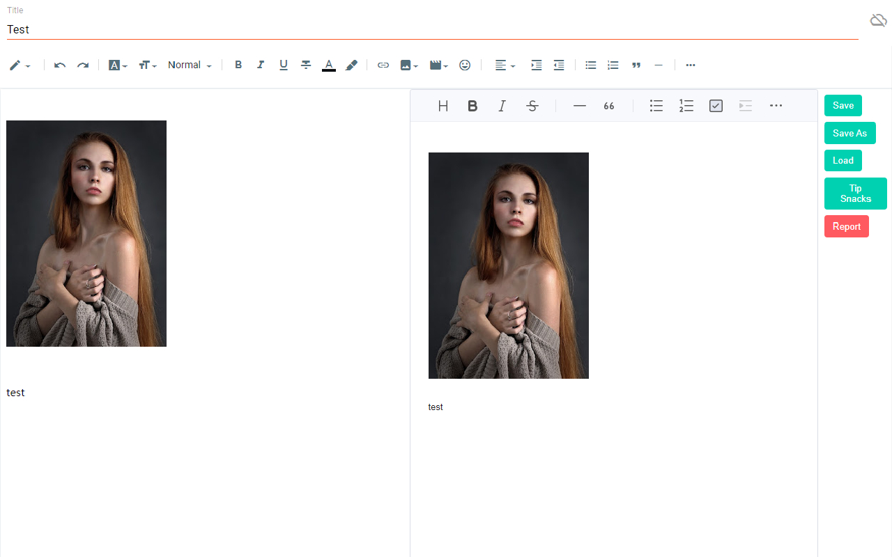

[한국어](./docs/ko)

# ✍ mdblogger


Markdown editor for blogger

## 📢 Notice

### Releasing v0.0.6

Finally, from this version, draft saving working! Tooltip is added. Happy blogging!

## 👨‍🏫 Things you must know:

1. If you have any ad block extensions/plugins, add `blogger.com` or `https://blogger.com` in the exception list from the ad block settings.

2. After you are done writing, you must edit the blogger's editor once before finishing your post. Like `adding a space and remove it` or `change from compose view to html view`. Because the content is not going to be saved as a draft or updated or published until the blogger editor updates the post data that is hidden. It is difficult to find where the blogger editor store our post data. So until we find a way, this will be the way. Just give a small change to the blogger editor after you are done writing.

3. Pressing 'Ctrl' and 'q' will copy what is in the blogger editor(Left side) and paste to the markdown editor(Right side). Use this short cut('ctrl + q') for adding images. But you can also use the markdown editor's image uploading system. In that case the image will be stored as a data in your post. And your post can be a bit messy. For the videos, you have to use the blogger editor to add them. Markdown editor does not support videos and it will probably convert the video to a single image.

4. From all the links in the post, target and rel attributes are not going to work as markdown does not support. And it will always get removed as you write something. You can still try. I do not encourage doing it though.

5. This extension is an open source extension with MIT license. It is free for commercial and non-commercial use.

6. If you have a custom theme, it might cause some problems for some cases. Because they affect styling of the edit page.

7. In many other case, if this extension is not working, just try to refresh(F5) the edit page. This extension does not back-up your data. So make sure you back-up your unsaved data. Eg. drafting, or save markdown etc.

## 😵 Shortcut:

### Copy the blogger editor's html data and paste it in the markdown editor

```
ctrl + q
```

## 😵 Issue:

Report an issue: [https://github.com/opdev1004/mdblogger/issues](https://github.com/opdev1004/mdblogger/issues)

## 💪 Support this extension:

- [Github sponsor page](https://github.com/sponsors/opdev1004)
- [ko-fi](https://ko-fi.com/opdev1004)

## 👨‍💻 Author

[Victor Chanil Park](https://github.com/opdev1004)

## 💯 License

MIT, See [LICENSE](./LICENSE).
